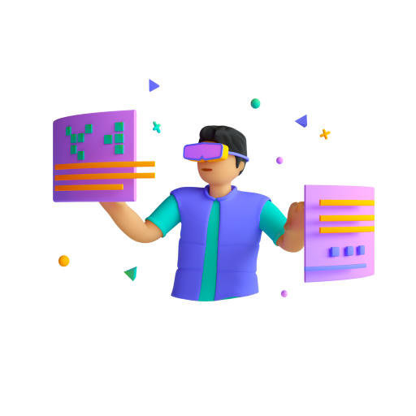

# @digipair-xr

Digipair vision provide a simple way to create your own web metaverse or 3D web components like a simple HTML page.  
Inspired from the very nice libraries [Polymer lit](https://lit.dev/) and [A-Frame](https://aframe.io/), you can create AR / VR / 3D elements on typescript classes like Angular/React/Lit.

<iframe src="https://codesandbox.io/embed/github/pinser-metaverse/pinser-metaverse-examples/tree/sample/?fontsize=10&hidenavigation=1&theme=dark&view=preview&module=/apps/metaverse/src/index.html"
     style="width:100%; height:500px; border:0; border-radius: 4px; overflow:hidden;"
     title="metaverse-bootstrap"
     allow="accelerometer; ambient-light-sensor; camera; encrypted-media; geolocation; gyroscope; hid; microphone; midi; payment; usb; vr; xr-spatial-tracking"
     sandbox="allow-forms allow-modals allow-popups allow-presentation allow-same-origin allow-scripts"
   ></iframe>

## Develop across all platforms

Digipair vision is compatible with :

- Mobile
- Tablet
- Desktop
- VR/AR/XR heaset

## Compatible with several realities

Your creation can be used on :

- Desktop / Phone and tablet Screen
- Virtual reality
- Mixed Reality / Augmented Reality

You want test it ? [try it now on your headset !](https://metaverse-bootstrap.onrender.com)

## Complete toolbox set

Thanks to the fantastic open source libraries to propose :

- 3D editor - [AFrame](https://aframe.io)
- Testing tool - [Jest](https://jestjs.io)
- Build system - [nx](https://nx.dev)
- Reactive web components - [lit-html](https://lit.dev)

You can apply all modern web development good practices

## What next

Follow the section [Get started](get-started)

### Try it now

### Join us

### Support

> Don't hesitate to improve this documentation, any help will be amazing !  
> 
