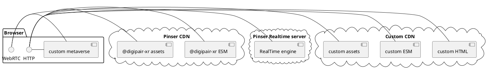
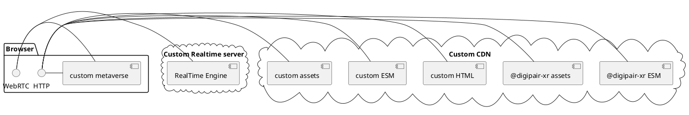

# How it works

[digipair-xr](https://opensource.digipair.ai) is a magic shake between [AFrame](https://aframe.io) for the 3D engine and [lit-html](https://lit.dev) for reactive webcomponent creation.

## Technical choices

To load the Javascript files, [digipair-xr](https://opensource.digipair.ai) uses [Javascript module](https://developer.mozilla.org/en-US/docs/Web/JavaScript/Guide/Modules) who is an html standard to load javascript files asynchronously (mainly webcomponents in our case).

About the realtime server, [digipair-xr](https://opensource.digipair.ai) uses easyRTC.  
The server is available here:  
https://github.com/digipair/digipair-xr/tree/master/apps/networked-server

## Infrastructure

[digipair-xr](https://opensource.digipair.ai) manage for you 2 stacks:

- IHM to manage the 3D display and the behavior (click, touch, lazer, teleportation, collision, ...)
- Realtime to manage data sharing in P2P (avatar position, object state, screen sharing, webcam, voice, ...)

### default configuration

Deploy a default configuration is really easy because all you need to do is to deploy your own files on a web server or a CDN.
By default, [digipair-xr](https://opensource.digipair.ai) use shared realtime servers and shared CDN.

### custom configuration

You can use too your own server to deploy pinser realtime engine and pinser ESM / assets.

> Don't hesitate to improve this documentation, any help will be amazing !  
> 
