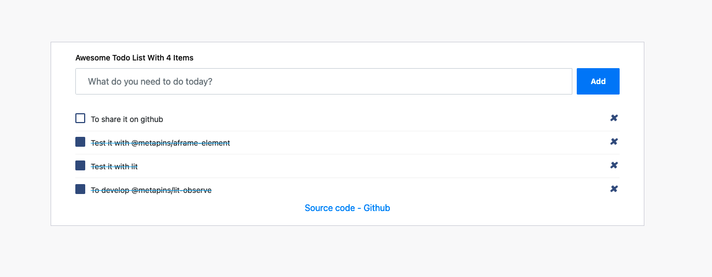

# @pinser-metaverse/observe

@pinser-metaverse/observe is a lit-html library for to display observables like rxjs or redux.

It tested with :

- [rxjs](https://rxjs.dev/): Reactive Extensions Library for JavaScript
- [lit](https://lit.dev/): Simple. Fast. Web Components.
- [aframe-element](https://github.com/pinserworld/pinser/tree/master/libs/utils/aframe-element): Simple library for building fast, lightweight web components for 3D development.

Code inspired from https://lit.dev/docs/templates/custom-directives/

## Installation

Use the package manager [npm](https://www.npmjs.com/package/@pinser-metaverse/observe) to install @pinser-metaverse/observe.

```bash
npm install @pinser-metaverse/observe
```

## Usage

### Simple usage

```typescript
import { observe } from '@pinser-metaverse/observe';
import { of } from 'rxjs';

// ...
title$ = of('Hello World');

render() {
  return html`
<h1>${observe(this.title$)}</h1>
  `;
}
```

### With callback

```typescript
import { observe } from '@pinser-metaverse/observe';
import { of } from 'rxjs';

// ...
list$ = of([
  { title: 'todo 1' },
  { title: 'todo 2' },
]);

render() {
  return html`
<ul>
  ${observe(this.list$, (list) => list.map((item) => html`
    <li>${item.title}</li>
  `))}
</ul>
  `;
}
```

## Example

### Todo-list with rxjs

- Demo: 
https://pinser-metaverse-observe-demo.onrender.com/
- Source code: 
https://github.com/pinser-metaverse/pinser-metaverse/tree/master/apps/observe-demo/src/app/app.element.ts




## Building

Run `nx build observe` to build the library.

## Running unit tests

Run `nx test observe` to execute the unit tests via [Jest](https://jestjs.io).

## Contributing

Pull requests are welcome. For major changes, please open an issue first to discuss what you would like to change.

Please make sure to update tests as appropriate.

## License

[MIT](https://choosealicense.com/licenses/mit/)
